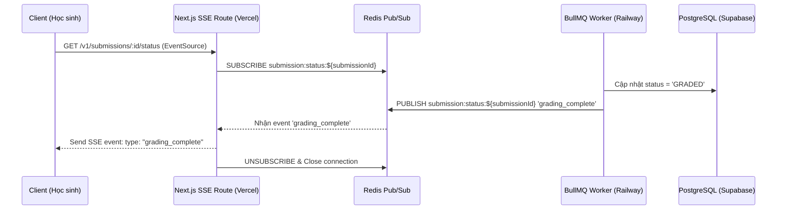

# PHỤ LỤC KIẾN TRÚC KỸ THUẬT — EduGrade AI
> [!NOTE]
> File này bổ sung các giải pháp kỹ thuật sâu sắc cho những vấn đề phân tán, xử lý AI, kiểm soát chi phí và bảo mật của EduGrade AI.

---

## 1. KIẾN TRÚC ĐỒNG BỘ HÓA REAL-TIME SSE TRONG MÔI TRƯỜNG PHÂN TÁN

### Vấn đề thiết kế
Khi triển khai Next.js App Router trên Vercel (Serverless/Stateless) và BullMQ Worker trên Railway (Stateful Server), có sự đứt gãy về giao tiếp trực tiếp. Client kết nối SSE đến Serverless Next.js, nhưng Worker chấm bài lại nằm ở Server Railway độc lập. Khi Worker ghi nhận trạng thái chấm bài xong trong database, Next.js API Routes không hề biết để thông báo cho Client đang chờ.

### Giải pháp kiến trúc (Redis Pub/Sub & SSE)
Sử dụng Redis (do đã có sẵn `REDIS_URL` phục vụ BullMQ) làm Message Broker kết nối giữa Worker và Serverless API.



#### Thiết lập minh họa trong code
1. **Next.js SSE Route Handler (`src/app/api/submissions/[id]/status/route.ts`):**
```typescript
import { NextRequest, NextResponse } from 'next/server';
import { getRedisClient } from '@/lib/redis';

export const dynamic = 'force-dynamic';

export async function GET(req: NextRequest, { params }: { params: { id: string } }) {
  const submissionId = params.id;
  const redis = getRedisClient(); // Client dùng cho pub/sub
  const duplicateRedis = redis.duplicate();
  await duplicateRedis.connect();

  const responseStream = new TransformStream();
  const writer = responseStream.writable.getWriter();
  const encoder = new TextEncoder();

  // Đăng ký nhận sự kiện từ Redis Channel
  const channel = `submission:status:${submissionId}`;
  
  await duplicateRedis.subscribe(channel, (message) => {
    writer.write(encoder.encode(`event: ${message}\ndata: ${JSON.stringify({ submissionId })}\n\n`));
    
    // Nếu hoàn thành hoặc lỗi thì đóng kết nối để giải phóng tài nguyên
    if (message === 'grading_complete' || message === 'grading_failed') {
      duplicateRedis.unsubscribe(channel);
      duplicateRedis.quit();
      writer.close();
    }
  });

  req.signal.addEventListener('abort', () => {
    duplicateRedis.unsubscribe(channel);
    duplicateRedis.quit();
    writer.close();
  });

  return new NextResponse(responseStream.readable, {
    headers: {
      'Content-Type': 'text/event-stream',
      'Cache-Control': 'no-cache, no-transform',
      'Connection': 'keep-alive',
    },
  });
}
```

2. **BullMQ Worker (`server/queue/workers/grading.worker.ts`):**
```typescript
import { redis } from '@/lib/redis';

// Sau khi hoàn thành lưu điểm vào DB
await redis.publish(`submission:status:${submissionId}`, 'grading_complete');
```

---

## 2. PHÒNG NGƯA GIAN LẬN OCR (OCR VERIFICATION & ABUSE CONTROL)

### Vấn đề thiết kế
Khi học sinh chụp ảnh nộp bài tự luận, hệ thống thực hiện OCR thông qua Google Cloud Vision API. Học sinh được phép xem và chỉnh sửa text bị nhận dạng sai qua `/v1/uploads/:uploadId/confirm-ocr` trước khi nộp chính thức. Tuy nhiên, học sinh có thể lợi dụng điều này để dán một bài làm hoàn toàn mới do AI viết hoặc copy từ nguồn khác vào khung chỉnh sửa (dù ảnh chụp giấy nháp thực tế không có chữ hoặc viết lung tung).

### Giải pháp kiến trúc
1. **Lưu trữ dữ liệu thô:** Trong bảng `SubmissionAnswer`, hệ thống bắt buộc lưu trữ song song hai trường:
   * `ocrRawText`: Kết quả chuỗi text thô nhận dạng trực tiếp từ API Google Cloud Vision (không cho phép sửa đổi).
   * `answerText`: Kết quả cuối cùng sau khi học sinh đã soát lỗi và nhấn confirm.
2. **Kiểm tra độ tương đồng (Similarity Check):**
   Trước khi chấp nhận kết quả confirm, hệ thống chạy thuật toán đo khoảng cách chuỗi (như Levenshtein Distance hoặc Cosine Similarity qua Vector Embeddings):
```typescript
import { compareTwoStrings } from 'string-similarity';

const similarity = compareTwoStrings(ocrRawText, confirmedText);

if (similarity < 0.65 && ocrConfidence > 0.70) {
  // Có sự sai lệch lớn trong khi ảnh chụp có độ tin cậy rất rõ ràng -> Nghi vấn gian lận
  await prisma.submission.update({
    where: { id: submissionId },
    data: {
      antiCheatLog: {
        push: {
          type: 'OCR_HEURISTIC_MISMATCH',
          message: 'Nội dung xác nhận khác biệt lớn so với kết quả quét hình ảnh gốc.',
          similarity,
          timestamp: new Date()
        }
      }
    }
  });
}
```
3. **Gắn cờ kiểm duyệt:** Nếu độ tương đồng dưới `0.65` và độ tự tin của OCR trên `0.70`, hệ thống tự động:
   * Thiết lập `ConfidenceLevel` của bản ghi breakdown tương ứng là `LOW` (bắt buộc giáo viên duyệt thủ công, ưu tiên đẩy lên đầu hàng đợi Review Queue).
   * Ghi log cảnh báo vào `antiCheatLog` của `Submission` và đẩy vào báo cáo chống gian lận (`/v1/assignments/:assignmentId/anti-cheat-report`).

---

## 3. PARSE JSON AN TOÀN VÀ XỬ LÝ LỖI LLM OUTPUT (ROBUST AI OUTPUT PARSING)

### Vấn đề thiết kế
Mặc dù Prompt yêu cầu định dạng JSON duy nhất, LLM thi thoảng trả về:
* Đoạn văn bản giải thích bên ngoài JSON.
* Chuỗi bị bọc trong markdown block: ` ```json { ... } ``` `
* JSON bị thiếu dấu đóng ngoặc hoặc sai định dạng do đạt giới hạn Max Tokens.

### Giải pháp kiến trúc
Sử dụng một bộ lọc parser 3 lớp:
1. **Lớp 1: Trích xuất bằng Regex:** Lọc lấy chuỗi nằm giữa cặp dấu `{` và `}` ngoài cùng để loại bỏ phần văn bản dư thừa bên ngoài.
2. **Lớp 2: Sửa lỗi JSON tự động:** Sử dụng thư viện `jsonrepair` để vá các lỗi cú pháp nhỏ (ví dụ: dấu phẩy thừa trước ngoặc đóng, thiếu dấu ngoặc kép ở key/value).
3. **Lớp 3: Validate định dạng bằng Zod:** Nếu khớp schema, cho đi tiếp. Nếu sai lệch nặng không thể sửa, chuyển sang cơ chế Retry hoặc hạ bậc tin cậy chấm bài về `LOW` để chuyển thẳng quyền quyết định cho giáo viên.

```typescript
import { z } from 'zod';
import { jsonrepair } from 'jsonrepair';

const aiResultSchema = z.object({
  rubricScores: z.array(z.object({
    rubricItemId: z.string().uuid(),
    scoreAwarded: z.number(),
    reasoning: z.string()
  })),
  overallScore: z.number(),
  overallComment: z.string(),
  improvementSuggestion: z.string(),
  confidence: z.enum(['HIGH', 'MEDIUM', 'LOW']),
  confidenceReason: z.string()
});

export function parseAIGradingResult(rawOutput: string) {
  try {
    // Bước 1: Trích xuất khối JSON bằng Regex
    const jsonMatch = rawOutput.match(/\{[\s\S]*\}/);
    if (!jsonMatch) throw new Error('NO_JSON_FOUND');

    let cleanJson = jsonMatch[0];

    // Bước 2: Sửa lỗi cú pháp nhẹ bằng jsonrepair
    try {
      cleanJson = jsonrepair(cleanJson);
    } catch {
      // Bỏ qua nếu jsonrepair không xử lý được, tiếp tục parse thô
    }

    // Bước 3: Parse & Validate bằng Zod
    const parsedData = JSON.parse(cleanJson);
    return aiResultSchema.parse(parsedData);
  } catch (error) {
    console.error('[AI Parser Error] Failed to parse LLM Output:', error);
    throw new Error('AI_OUTPUT_PARSING_FAILED');
  }
}
```

---

## 4. PHÒNG THỦ CHI PHÍ AI (COST DEFENSE & QUOTA CONTROL)

### Vấn đề thiết kế
Gọi API LLM (như GPT-4o) chấm tự luận rất tốn kém. Nếu học sinh spam nút nộp bài liên tục, hoặc tài khoản giáo viên/nhà trường bị tấn công làm cạn kiệt hạn mức, chi phí vận hành sẽ tăng phi mã.

### Giải pháp kiến trúc
1. **Kiểm tra Quota cứng trước khi chạy Queue:**
   Trước khi cho phép học sinh nộp bài hoặc AI bắt đầu chấm, check số dư tín chỉ AI của trường học (`Organization`).
```typescript
const orgQuota = await prisma.organization.findUnique({
  where: { id: orgId },
  select: { aiCreditsUsedThisMonth: true, quotaAiCreditsMonthly: true }
});

if (orgQuota.aiCreditsUsedThisMonth >= orgQuota.quotaAiCreditsMonthly) {
  throw new TRPCError({
    code: 'BAD_REQUEST',
    message: 'Tài khoản trường học đã hết hạn mức tín chỉ AI trong tháng này. Vui lòng liên hệ quản trị viên.'
  });
}
```
2. **Khóa tạm thời (Rate Limiting):**
   Thiết lập Rate Limit cụ thể cho học sinh trên đầu endpoint nộp bài (`Submit: 5 req/m/student`). Nếu vượt quá, trả về mã lỗi `RATE_LIMIT_EXCEEDED` lập tức để giảm tải.
3. **Cơ chế Dynamic Fallback & Cost Optimizer:**
   * Mặc định sử dụng **GPT-4o** cho các bài kiểm tra quan trọng như Thi học kỳ, Đề thi thử THPT Quốc gia (cấu hình trong thuộc tính của `Assignment`).
   * Sử dụng **Gemini 1.5 Flash** (rẻ hơn đáng kể) làm bộ chấm nháp cho các bài tập 15 phút hoặc bài tập về nhà thông thường để tiết kiệm đến 80% chi phí API.
