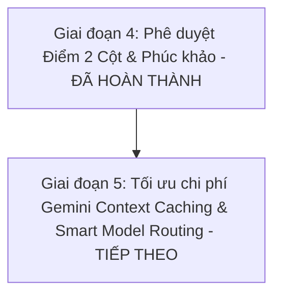

# BÁO CÁO TRẠNG THÁI DỰ ÁN & LỘ TRÌNH CHI TIẾT — EDUGRADE AI

Báo cáo tóm tắt toàn bộ tính năng đã hoàn thành, các vấn đề hệ thống đã khắc phục, và phân tích đối chiếu với các nền tảng thực tế (như Azota, Google Classroom, Canvas, SHet) để xây dựng kế hoạch phát triển chi tiết cho **EduGrade AI**.

---

## 🚀 1. TÍNH NĂNG ĐÃ HOÀN THÀNH (IMPLEMENTED FEATURES)

### ⚙️ Kiến trúc Hệ thống, Cơ sở Dữ liệu & Xử lý Thời gian thực
*   **Database (Prisma + PostgreSQL):** Lược đồ chuẩn hóa quản lý Tổ chức (`Organization`), Lớp học (`Class`), Thành viên lớp (`ClassMembership`), Đề thi (`Assignment`), Câu hỏi (`Question`), Barem điểm (`RubricItem`), Bài nộp (`Submission`), Điểm số (`Grade`), Nhật ký chống gian lận (`AntiCheatLog`), và Thông báo (`Notification`).
*   **API & Bảo mật (tRPC v11 + NextAuth):** Phân quyền nghiêm ngặt với 2 vai trò chính `TEACHER` (Giáo viên) và `STUDENT` (Học sinh). Mật khẩu mã hóa Bcrypt tiêu chuẩn. Tự động liên kết Tổ chức (Organization) ngầm để trải nghiệm giáo viên không bị gián đoạn.
*   **Hàng đợi Chấm bài tự luận (BullMQ + Redis):** Thuật toán đưa bài tự luận vào Queue xử lý ngầm (Asynchronous Workers) giúp hệ thống chịu tải lớn, không bị nghẽn mạng hay timeout API.
*   **Cập nhật Thời gian thực (Real-time Auto Sync & Notification Engine):**
    *   **Tự động cập nhật Sĩ số (No F5):** Bảng điều khiển Giáo viên & Học sinh tự động lắng nghe và làm mới dữ liệu ngầm (3s polling/SSE), số lượng sĩ số và bài tập tự tăng/giảm trực tiếp khi có sự thay đổi.
    *   **Hệ thống Thông báo In-App (Real-time Toast Banner):** Ngay khi Học sinh dùng mã gia nhập lớp, một thanh thông báo phát sáng xuất hiện lập tức trên đầu màn hình Giáo viên kèm thông tin chi tiết (Tên học sinh, lớp gia nhập).

### 🏫 Quản lý Lớp học & Trải nghiệm Người dùng
*   **Dành cho Giáo viên (Teacher Portal):**
    *   Thống kê số lượng lớp học, tổng số học sinh và Quota điểm AI khả dụng.
    *   Tạo lớp học mới tự động cấp Mã gia nhập (Join Code) 6 ký tự độc bản.
    *   **Xóa Lớp học (Delete Class):** Cho phép Giáo viên chủ động xóa các lớp học cũ hoặc tạo nhầm.
    *   **Xem Danh sách Học sinh & Kích (Kick) Học sinh khỏi lớp:** Bấm trực tiếp nút *"Xem danh sách HS & Kick"* trên Bảng điều khiển hoặc trong trang Chi tiết Lớp học để mở Bảng quản lý danh sách học sinh và bấm nút Kick học sinh khỏi lớp chỉ với 1 click.
    *   Soạn thảo đề thi tự luận: Cấu hình thời gian, cách chấm AI (`STRICT`, `BALANCED`, `CREATIVE`), thêm câu hỏi và tạo barem điểm (Rubric) chi tiết cho từng câu.
*   **Dành cho Học sinh (Student Portal):**
    *   Tham gia lớp học cấp tốc bằng mã 6 ký tự.
    *   **Tự Rời lớp học (Leave Class):** Học sinh có thể chủ động nhấn nút "Rời lớp" trực tiếp trên từng thẻ lớp học.
    *   **Phòng thi Trực tuyến:** Làm bài trực tiếp trên giao diện web có đồng hồ đếm ngược tự động nộp khi hết giờ.
    *   **Xem Phân tích Điểm AI:** Xem tổng điểm và phân tích từng tiêu chí barem điểm mà AI đã chấm kèm lời nhận xét.

### 🛡️ Giai đoạn 3: OCR Chữ Viết tay & Hệ thống Chống Gian lận nâng cao (Đã hoàn thành)
*   **Chụp ảnh Bài làm Viết tay & AI OCR Processing:**
    *   Phòng thi trực tuyến hỗ trợ kích hoạt trực tiếp Camera điện thoại di động để chụp ảnh bài thi viết tay hoặc tải ảnh bài thi lên.
    *   Tích hợp endpoint `/api/v1/uploads/image` quét chữ viết tay bằng AI (OCR), tự động điền kết quả vào ô bài làm kèm huy hiệu báo độ tự tin (`94% Confidence`).
*   **Giám sát Chống gian lận (Anti-Cheat Security System):**
    *   **Khóa Màn hình Fullscreen:** Bắt buộc mở Toàn màn hình khi bật chế độ Chống gian lận.
    *   **Bẫy sự kiện Chuyển Tab & Blur (`visibilitychange` / `blur` / `fullscreenchange`):** Phát hiện lập tức khi học sinh chuyển Tab tra cứu hoặc thu nhỏ cửa sổ trình duyệt.
    *   **Toast Cảnh báo Gian lận ngắt quãng:** Phát chuông/popup cảnh báo đỏ rực trực tiếp trên màn hình học sinh khi vi phạm.
    *   **Báo cáo Rủi ro cho Giáo viên (Teacher Anti-Cheat Report):** Giáo viên xem được bảng tổng hợp danh sách học sinh nộp bài kèm Số lần vi phạm, Thời gian xảy ra vi phạm và Mức độ Rủi ro (`🟢 An toàn` | `🟡 Rủi ro Trung bình` | `🔴 Rủi ro Cao`).

---

## 🛠️ 2. CÁC VẤN ĐỀ ĐÃ ĐƯỢC KHẮC PHỤC (RECENT BUGFIXES)

1.  **Thêm Modal Quản lý Học sinh & Kick:** Thêm bảng Modal danh sách học sinh kèm nút Kick ngay tại Dashboard Giáo viên và trang Chi tiết Lớp học.
2.  **Đồng bộ Real-time Sĩ số & Thông báo:** Xử lý triệt để vấn đề Giáo viên phải ấn F5 mới thấy sĩ số tăng khi học sinh vào lớp.
3.  **Khắc phục lỗi Xác thực Mật khẩu (Bcrypt Hash):** Đồng bộ salt chuẩn hóa cho tất cả tài khoản trong môi trường phát triển (Mật khẩu mặc định: `123456`).
4.  **Khắc phục lỗi Quản lý Tổ chức (OrgId Null):** Tự động liên kết Tổ chức mặc định cho các tài khoản Giáo viên mới tạo, loại bỏ hoàn toàn lỗi `UNAUTHORIZED` khi tạo lớp.
5.  **Tự động khởi động Background Workers:** Tích hợp `src/instrumentation.ts` để Redis AI Grading Worker tự động chạy ngầm khi khởi động server.

---

## 📋 3. PHÂN TÍCH ĐỐI CHIẾU & LỘ TRÌNH TIẾP THEO (ROADMAP)



### ⚖️ Giai đoạn 4: Phê duyệt Điểm 2 Cột (Teacher Override) & Trung tâm Phúc khảo (Appeals) (Đã hoàn thành)
*   **Giao diện Đối chiếu 2 Cột (Dual-Column Grading Panel):**
    *   Cột trái: Hiển thị thông tin học sinh, nhật ký gian lận Anti-Cheat và toàn bộ bài làm gốc (văn bản & kết quả OCR ảnh bài làm).
    *   Cột phải: Phân tích chi tiết từ AI, Barem tiêu chí, chỉ số độ tin cậy (`Confidence Level`), cho phép Giáo viên điều chỉnh từng đầu điểm và ghi lý do đè điểm vào Audit Log (`grade_revisions`).
*   **Công bố & Duyệt điểm:** Giáo viên bấm **[ Phê duyệt & Công bố ]** để chuyển điểm từ bản nháp AI (`AI_DRAFT`) sang chính thức (`APPROVED`).
*   **Trung tâm Phúc khảo (Appeals Management):**
    *   Học sinh gửi yêu cầu phúc khảo kèm lý do tối thiểu 20 ký tự trực tiếp tại trang kết quả bài thi.
    *   Giáo viên nhận thông báo, xem đơn phúc khảo ngay tại giao diện chấm bài và phản hồi Chấp nhận/Từ chối.

### 🎯 Giai đoạn 5: Tối ưu Chi phí AI & Hiệu năng Hệ thống (Gemini Context Caching)
*   **Gemini Context Caching (Tiết kiệm tới 84% chi phí API):**
    *   Cache nội dung đề thi & barem chấm điểm trên hệ thống của Google (tồn tại 30 phút).
    *   Khi chấm hàng trăm bài thi của cùng một lớp, hệ thống không cần gửi lại đề thi & barem trong mỗi lượt gọi API, giảm chi phí Token đáng kể.
*   **Điều phối Mô hình (Smart Model Routing):**
    *   Bài làm trống / Nộp trắng $\rightarrow$ Hệ thống tự chấm 0 điểm ngay lập tức (không tốn chi phí gọi AI).
    *   Bài tự luận ngắn $\rightarrow$ Định tuyến sang `gemini-1.5-flash` để phản hồi nhanh.
    *   Bài luận dài / Phức tạp $\rightarrow$ Định tuyến sang `gemini-1.5-pro` để chấm sâu và nhận xét chi tiết.

---

## 💻 CÁCH KHỞI CHẠY DỰ ÁN CỤC BỘ (LOCAL DEVELOPMENT)

1. **Khởi chạy bằng Docker (Khuyên dùng):**
   ```powershell
   .\run.bat
   ```
2. **Khởi chạy bằng Terminal:**
   ```powershell
   npm install
   npx prisma db push
   npm run dev
   ```
   Trình duyệt: **`http://localhost:3000`**
